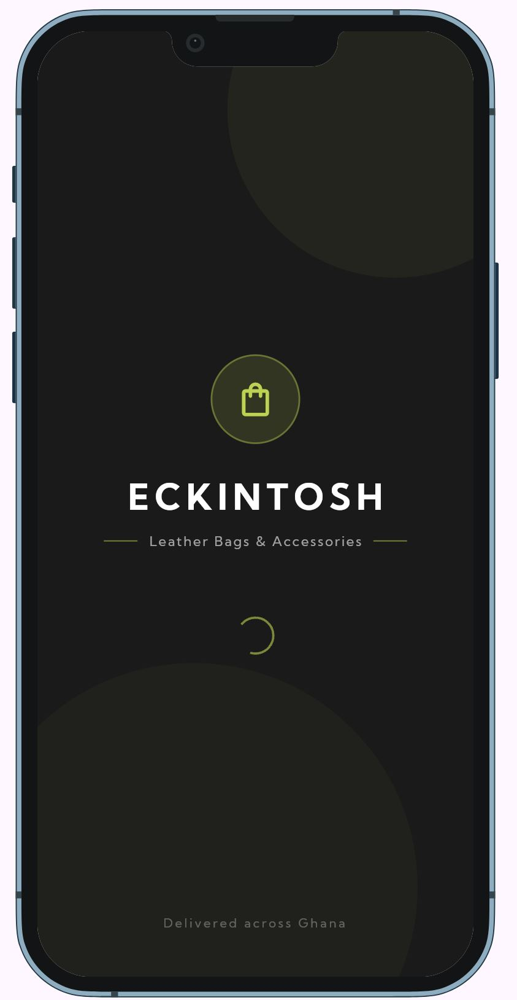
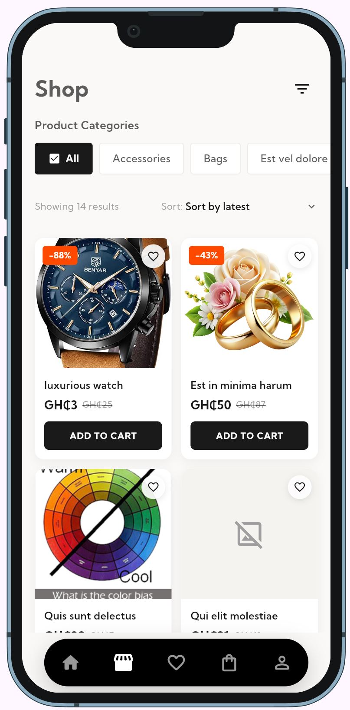
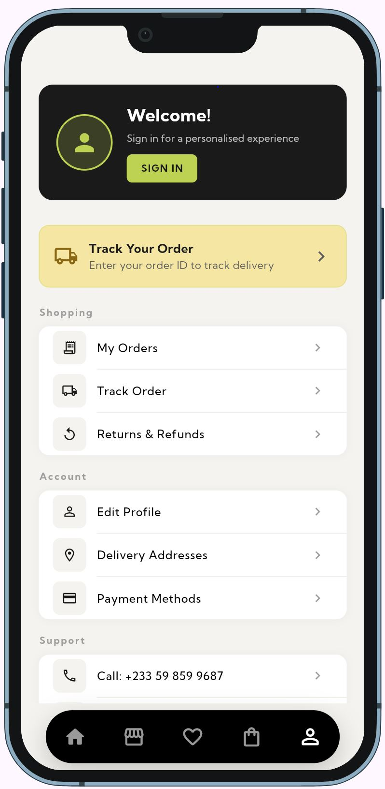

# ECKINTOSH Mall - Premium E-commerce Storefront

A high-end, **full-stack e-commerce platform** designed for a seamless shopping experience. **Eckintosh Mall** combines a visually stunning **Flutter** mobile application with a powerful **Next.js** backend to deliver speed, reliability, and elegance.

---

## Features

- **Premium UI/UX**: Crafted with the **Kumbh Sans** typeface and fluid **Lottie** animations for a luxury feel.
- **Dynamic Catalog**: Real-time product synchronization powered by **Next.js** and **Prisma**.
- **Smart Filtering**: Advanced search and categorization to help users find products effortlessly.
- **Secure Checkout**: Streamlined order creation process with real-time backend validation.
- **Order Tracking**: Track orders from placement to delivery using unique tracking IDs.
- **Responsive Design**: Fully optimized for **Android**, **iOS**, and **Web** platforms.
- **Admin Dashboard**: Centralized management for products, orders, and customer data.

---

## Tech Stack

### **Frontend (Mobile & Web)**

- **Framework**: Flutter (Dart)
- **State Management**: BLoC (Business Logic Component)
- **Styling**: Custom Theme System, Google Fonts (Kumbh Sans)
- **Animations**: Lottie, Animate_do, Flutter Staggered Animations

### **Backend (API & Database)**

- **Framework**: Next.js (App Router)
- **ORM**: Prisma
- **Database**: PostgreSQL (Hosted on Neon)
- **API**: RESTful architecture

---

## Screenshots

|                 Splash Screen                  |                Home Page                 |              Product Details              |                                           | profile |
| :--------------------------------------------: | :--------------------------------------: | :---------------------------------------: | :---------------------------------------: | ------- |
|  |  |  |  |

---

## Installation & Setup

### **1. Prerequisites**

- **Flutter SDK** (Latest stable version)
- **Node.js** (v18 or higher)
- **PostgreSQL** database (Local or Cloud like Neon.tech)

### **2. Backend & Database Setup**

Navigate to the `backend` directory and follow these steps:

```bash
# Install dependencies
npm install

# Configure environment variables
# Create a .env file based on .env.example with your DATABASE_URL

# Generate Prisma Client & Push Schema
npx prisma generate
npx prisma db push

# Seed the database with demo products
npx prisma db seed

# Start the development server
npm run dev -- --hostname 0.0.0.0
```

_The backend will run on `http://localhost:3000`._

### **3. Flutter Application**

From the project root directory:

```bash
# Fetch dependencies
flutter pub get

# Run the app (Standard)
flutter run

# Run on physical device (with machine IP)
flutter run --dart-define=API_BASE_URL=http://your-ip-address:3000/api
```

---

## Future Roadmap

- [ ] **AI Recommendations**: Personalizing the shopping feed based on user behavior.
- [ ] **Multi-Vendor Support**: Allowing third-party sellers to list products.
- [ ] **Real-time Notifications**: Firebase Cloud Messaging for order updates and promos.
- [ ] **Payment Integration**: Adding Stripe, Flutterwave, or Paystack for live transactions.

---

## License

This project is licensed under the **MIT License** - see the [LICENSE](LICENSE) file for details.
